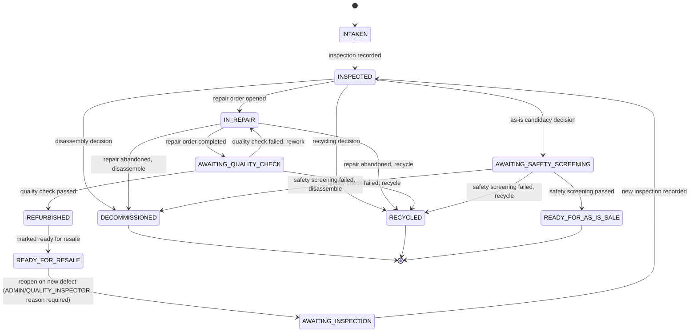

# GearCycle — Device Lifecycle

Status: Draft Last updated: 2026-06-26 (revised after human review)

This document defines the device lifecycle status model owned by `device-service`. It is intentionally minimal: it covers only the transitions needed to support the MVP user journeys in `docs/product-scope.md`, and avoids speculative states or transitions that cannot yet be implemented end-to-end.

> **Revision note:** This version incorporates approved human decisions on repair cancellation vs. abort, quality check rework, reopening a resale-ready device, renaming the as-is path to `READY_FOR_AS_IS_SALE`, and terminal-status irreversibility. See `docs/adr/` and `docs/product-scope.md` for the decisions themselves; this document reflects their consequences in the state model.

## 1. Device Lifecycle Statuses

| Status                      | Meaning                                                                                                                                                                                                                | Terminal? |
| --------------------------- | ---------------------------------------------------------------------------------------------------------------------------------------------------------------------------------------------------------------------- | --------- |
| `INTAKEN`                   | Device has been registered into the system; not yet inspected.                                                                                                                                                         | No        |
| `INSPECTED`                 | Inspection complete; diagnostic findings recorded; awaiting a repair/disassemble/recycle/as-is decision.                                                                                                               | No        |
| `IN_REPAIR`                 | A repair order is open and active against this device.                                                                                                                                                                 | No        |
| `AWAITING_QUALITY_CHECK`    | Repair order completed; awaiting quality control verification.                                                                                                                                                         | No        |
| `AWAITING_SAFETY_SCREENING` | Device judged unrepairable but potentially sellable as-is; awaiting safety screening (not full functional certification).                                                                                              | No        |
| `REFURBISHED`               | Passed quality check after repair; eligible for resale preparation.                                                                                                                                                    | No        |
| `READY_FOR_RESALE`          | Marked by SALES_OPERATOR as ready for resale (status marker only; no transaction processing in MVP).                                                                                                                   | No        |
| `AWAITING_INSPECTION`       | A new defect was discovered on a`READY_FOR_RESALE`device; device has been reopened and requires a fresh inspection before any further decision.                                                                        | No        |
| `READY_FOR_AS_IS_SALE`      | Passed safety screening; documented with known defects; eligible for as-is resale preparation. Does not require full functional certification.**Not a terminal status**— no actual sale is recorded against it in MVP. | No        |
| `DECOMMISSIONED`            | Marked as a donor device for disassembly; recovered parts may be harvested.                                                                                                                                            | **Yes**   |
| `RECYCLED`                  | Sent for responsible recycling; no reusable value remains.                                                                                                                                                             | **Yes**   |

**Naming note:** the status formerly named `SOLD_AS_IS` is renamed to `READY_FOR_AS_IS_SALE`. The MVP does not implement actual sales transactions for either resale path; both `READY_FOR_RESALE` and `READY_FOR_AS_IS_SALE` are status markers describing readiness, not sale records. Neither is terminal, since a sale event does not exist yet to make them so. Any future `SOLD` status (e.g., `SOLD`, `SOLD_AS_IS_COMPLETED`) introduced when real sales processing is built will be the terminal status on this path, not the readiness marker documented here.

## 2. Valid Transitions

| From                        | To                          | Trigger                                              | Preconditions                                                                                                                                                                                                                                                                                 |
| --------------------------- | --------------------------- | ---------------------------------------------------- | --------------------------------------------------------------------------------------------------------------------------------------------------------------------------------------------------------------------------------------------------------------------------------------------- |
| `INTAKEN`                   | `INSPECTED`                 | Inspection recorded                                  | Device exists in`INTAKEN`; inspection produced at least one diagnostic finding.                                                                                                                                                                                                               |
| `INSPECTED`                 | `IN_REPAIR`                 | Repair order opened                                  | Device exists in`INSPECTED`; an authorized actor opens a repair order referencing this device.                                                                                                                                                                                                |
| `INSPECTED`                 | `DECOMMISSIONED`            | Disassembly decision                                 | Device exists in`INSPECTED`; an authorized actor judges the device not economically repairable and chooses disassembly.                                                                                                                                                                       |
| `INSPECTED`                 | `AWAITING_SAFETY_SCREENING` | As-is sale candidacy decision                        | Device exists in`INSPECTED`; an authorized actor judges the device unrepairable but potentially sellable in current condition.                                                                                                                                                                |
| `INSPECTED`                 | `RECYCLED`                  | Recycling decision                                   | Device exists in`INSPECTED`; an authorized actor judges the device has no repair, resale, or part-recovery value.                                                                                                                                                                             |
| `IN_REPAIR`                 | `AWAITING_QUALITY_CHECK`    | Repair order completed                               | The linked repair order reaches`COMPLETED`status (parts installed/consumed as needed; see Section 9 on cancellation vs. abort).                                                                                                                                                               |
| `IN_REPAIR`                 | `DECOMMISSIONED`            | Repair abandoned, routed to disassembly              | Repair order is cancelled or aborted; an authorized actor decides disassembly is the next step.                                                                                                                                                                                               |
| `IN_REPAIR`                 | `RECYCLED`                  | Repair abandoned, routed to recycling                | Repair order is cancelled or aborted; an authorized actor decides recycling is the next step.                                                                                                                                                                                                 |
| `AWAITING_QUALITY_CHECK`    | `REFURBISHED`               | Quality check passed                                 | A new, immutable quality check record has outcome`PASSED`.                                                                                                                                                                                                                                    |
| `AWAITING_QUALITY_CHECK`    | `IN_REPAIR`                 | Quality check failed, rework required                | A new, immutable quality check record has outcome`FAILED`. Every failure creates a rework requirement; there is no fixed retry limit in the MVP (see Section 7). A new repair order is opened for the rework; the original repair order and the failed quality check record are never edited. |
| `AWAITING_QUALITY_CHECK`    | `RECYCLED`                  | Quality check failed, not worth further repair       | Quality check record has outcome`FAILED`; an authorized actor chooses recycling instead of further rework.                                                                                                                                                                                    |
| `AWAITING_SAFETY_SCREENING` | `READY_FOR_AS_IS_SALE`      | Safety screening passed                              | A safety screening record has outcome`PASSED`; documented known defects are recorded. Full functional quality control is not required.                                                                                                                                                        |
| `AWAITING_SAFETY_SCREENING` | `DECOMMISSIONED`            | Safety screening failed, routed to disassembly       | Safety screening outcome is`FAILED`; an authorized actor decides disassembly is the next step.                                                                                                                                                                                                |
| `AWAITING_SAFETY_SCREENING` | `RECYCLED`                  | Safety screening failed, not sellable or recoverable | Safety screening outcome is`FAILED`; an authorized actor decides recycling.                                                                                                                                                                                                                   |
| `REFURBISHED`               | `READY_FOR_RESALE`          | Marked ready for resale                              | Device exists in`REFURBISHED`; SALES_OPERATOR or ADMIN marks it ready.                                                                                                                                                                                                                        |
| `READY_FOR_RESALE`          | `AWAITING_INSPECTION`       | Reopen on newly discovered defect                    | Explicit reopen operation; mandatory reason recorded; actor is ADMIN or QUALITY_INSPECTOR; transition recorded in lifecycle history (see Section 8).                                                                                                                                          |
| `AWAITING_INSPECTION`       | `INSPECTED`                 | New inspection recorded                              | A fresh inspection is recorded against the device, producing new diagnostic findings. The device then follows the normal`INSPECTED`transitions above.                                                                                                                                         |

Note on repair rework that does not change device status: if a repair order is aborted (see Section 9) and a new repair order is opened immediately for continued rework on the same device, the device's lifecycle status can remain `IN_REPAIR` throughout — there is no transition "out and back in" at the device-status level for this case, since `IN_REPAIR` already covers "a repair order is open and active." Only repair-service's own repair-order records change in this scenario.

## 3. Invalid Transitions (explicitly rejected)

- Any transition **out of** a terminal status (`DECOMMISSIONED`, `RECYCLED`, and any future `SOLD`-type status) is invalid. These statuses can never return to an active lifecycle through normal lifecycle APIs, and no correction API exists for them in the MVP (see Section 10).
- `INTAKEN` → any status other than `INSPECTED` is invalid. A device must be inspected before any repair/disassemble/recycle/as-is decision is made.
- `IN_REPAIR` → `REFURBISHED` directly is invalid. A device cannot skip the quality check.
- `IN_REPAIR` → `AWAITING_SAFETY_SCREENING` or `READY_FOR_AS_IS_SALE` is invalid. Once repair work has begun, the device is on the repair path; the as-is path applies only to devices judged unrepairable at the inspection decision point, before repair work starts.
- `READY_FOR_RESALE` → `IN_REPAIR` directly is invalid. A newly discovered defect must route through `AWAITING_INSPECTION` → `INSPECTED` first, so the defect is diagnosed before any repair order is opened — this preserves the same inspect-before-repair invariant used elsewhere in the lifecycle.
- `READY_FOR_AS_IS_SALE` → `REFURBISHED` is invalid. The as-is path and the repaired/refurbished path are distinct; an as-is device that was never functionally certified cannot be retroactively treated as refurbished without going through actual repair and quality control.

## 4. Actor Permissions

| Transition                                         | Authorized actor(s)                                                       |
| -------------------------------------------------- | ------------------------------------------------------------------------- |
| `INTAKEN`→`INSPECTED`                              | TECHNICIAN                                                                |
| `AWAITING_INSPECTION`→`INSPECTED`                  | TECHNICIAN                                                                |
| `INSPECTED`→`IN_REPAIR`                            | TECHNICIAN, ADMIN                                                         |
| `INSPECTED`→`DECOMMISSIONED`                       | TECHNICIAN, ADMIN                                                         |
| `INSPECTED`→`AWAITING_SAFETY_SCREENING`            | ADMIN                                                                     |
| `INSPECTED`→`RECYCLED`                             | TECHNICIAN, ADMIN                                                         |
| `IN_REPAIR`→`AWAITING_QUALITY_CHECK`               | System-triggered (on repair order completion); no direct human transition |
| `IN_REPAIR`→`DECOMMISSIONED`                       | ADMIN                                                                     |
| `IN_REPAIR`→`RECYCLED`                             | ADMIN                                                                     |
| `AWAITING_QUALITY_CHECK`→`REFURBISHED`             | QUALITY_INSPECTOR                                                         |
| `AWAITING_QUALITY_CHECK`→`IN_REPAIR`(rework)       | QUALITY_INSPECTOR                                                         |
| `AWAITING_QUALITY_CHECK`→`RECYCLED`                | QUALITY_INSPECTOR, ADMIN                                                  |
| `AWAITING_SAFETY_SCREENING`→`READY_FOR_AS_IS_SALE` | QUALITY_INSPECTOR                                                         |
| `AWAITING_SAFETY_SCREENING`→`DECOMMISSIONED`       | QUALITY_INSPECTOR, ADMIN                                                  |
| `AWAITING_SAFETY_SCREENING`→`RECYCLED`             | QUALITY_INSPECTOR, ADMIN                                                  |
| `REFURBISHED`→`READY_FOR_RESALE`                   | SALES_OPERATOR, ADMIN                                                     |
| `READY_FOR_RESALE`→`AWAITING_INSPECTION`           | ADMIN, QUALITY_INSPECTOR                                                  |

ADMIN is included as a permissions backstop for exceptional cases but is not intended as the routine actor for any transition that has a more specific role available.

## 5. Events Produced by Important Transitions

| Transition                               | Event published                | Version |
| ---------------------------------------- | ------------------------------ | ------- |
| `INTAKEN`→`INSPECTED`                    | `DeviceLifecycleStatusChanged` | v1      |
| `AWAITING_INSPECTION`→`INSPECTED`        | `DeviceLifecycleStatusChanged` | v1      |
| Any →`DECOMMISSIONED`                    | `DeviceDecommissioned`         | v1      |
| Any →`REFURBISHED`                       | `DeviceLifecycleStatusChanged` | v1      |
| Any →`RECYCLED`                          | `DeviceLifecycleStatusChanged` | v1      |
| Any →`READY_FOR_AS_IS_SALE`              | `DeviceLifecycleStatusChanged` | v1      |
| Any →`READY_FOR_RESALE`                  | `DeviceLifecycleStatusChanged` | v1      |
| `READY_FOR_RESALE`→`AWAITING_INSPECTION` | `DeviceResaleReadyReopened`    | v1      |

`DeviceLifecycleStatusChanged` is published on every transition (carrying previous status, new status, and a trigger reference) so consumers do not need a separate event per transition type. `DeviceDecommissioned` is published in addition to the generic event, since inventory-service has a specific reason to react to that particular transition. A dedicated `DeviceResaleReadyReopened` event is published for the reopen transition, since it carries the mandatory reopen reason and the reopening actor's identity, which other consumers (e.g., notification-service) may need specifically — rather than overloading the generic event with reopen-specific fields it does not need for any other transition.

## 6. Terminal Statuses

- `DECOMMISSIONED`
- `RECYCLED`
- Any future `SOLD`-type status introduced when real sales processing is built (not present in the MVP; see Section 10).

`READY_FOR_RESALE` and `READY_FOR_AS_IS_SALE` are **not terminal**. `READY_FOR_RESALE` can return to `AWAITING_INSPECTION` via the explicit reopen operation. `READY_FOR_AS_IS_SALE` has no transition out of it defined in the MVP simply because no further business need has been identified yet (no sale exists to trigger a next step, and no reopen requirement for the as-is path has been specified) — this is an absence of a defined transition, not a terminal-status invariant, and should not be hardcoded as such in the domain model.

No transition out of `DECOMMISSIONED` or `RECYCLED` exists. This is enforced in the domain model itself (not only via API validation), so the invariant holds even if Bean Validation is bypassed.

## 7. Quality Check and Safety Screening Rework Rules

- Quality checks are append-only and immutable. A failed quality check is never edited, deleted, or reused for a subsequent attempt.
- Each failed quality check creates a rework requirement: the device returns to `IN_REPAIR` under a **new** repair order, and a **new** quality check record must be created after that rework is completed. Quality check records and repair orders accumulate as history; they are never overwritten.
- There is no fixed retry limit in the MVP. A device may cycle through `IN_REPAIR` → `AWAITING_QUALITY_CHECK` → (fail) → `IN_REPAIR` indefinitely until an authorized actor (QUALITY_INSPECTOR or ADMIN) instead chooses to route the device to `RECYCLED`. This is a deliberate, human-in-the-loop decision at each failure, not a system-enforced cap.
- Safety screening (for the as-is path) follows the same immutability principle: each safety screening attempt is its own immutable record. Safety screening is **functionally distinct** from quality control (see Section 7.1) and from inspection (see Section 7.2) — these are three separate activities, not interchangeable steps.

### 7.1 Safety screening vs. quality control

- **Quality control** verifies that repair work was performed correctly and the device is fully functional. It gates `REFURBISHED`.
- **Safety screening** verifies only that a device with known, accepted defects is not hazardous to handle, store, or use as-is (e.g., no exposed wiring, no battery swelling, no physical hazard). It does **not** verify full functionality and does not gate `REFURBISHED`. It gates `READY_FOR_AS_IS_SALE` only.
- A device that has passed safety screening is not "quality controlled" in any sense that would justify treating it as refurbished. The two outcomes must never be merged into a single check or a single record type, since they carry different guarantees to downstream actors (notably SALES_OPERATOR and, eventually, a buyer).

### 7.2 Safety screening / quality control vs. inspection

- **Inspection** is a pre-decision diagnostic activity performed before the repair-or-disassemble-or-as-is-or-recycle decision is made. It produces diagnostic findings used as _input_ to that decision.
- **Quality control** and **safety screening** are post-decision gating activities performed _after_ a decision has been acted on (repair completed, or as-is candidacy chosen), and they produce a pass/fail _outcome_ on a specific downstream status, not a general diagnosis.
- All three activities are performed by different roles or at different points: TECHNICIAN performs inspection; QUALITY_INSPECTOR performs both quality control and safety screening, but as distinct record types with distinct semantics, never conflated into one.

## 8. Reopening a Resale-Ready Device

- A device in `READY_FOR_RESALE` may be reopened only through an explicit reopen operation — never as a side effect of any other action.
- The reopen operation requires:
  - A mandatory reason (free text or a constrained reason code; exact representation is an implementation detail for when this is built).
  - An actor with ADMIN or QUALITY_INSPECTOR authority.
- On reopen, the device transitions to `AWAITING_INSPECTION`, not directly to `IN_REPAIR` or `INSPECTED`, because the newly discovered defect has not yet been diagnosed — it must go through a fresh inspection first, consistent with the inspect-before-decide invariant used throughout the lifecycle.
- The transition, its reason, and the reopening actor are recorded in lifecycle history via the `DeviceResaleReadyReopened` event and the device's status history record. This history is never deleted or edited.
- This reopen path does not exist for `READY_FOR_AS_IS_SALE` in the MVP; no equivalent requirement has been specified for that path (see Section 6 and the unresolved decisions in `docs/product-scope.md`).

## 9. Repair Order Cancellation vs. Abort

This section clarifies the distinction between **cancellation** and **abort**, which previously was not modeled and which directly affects inventory stock history.

- **Cancellation** applies only when **no parts have been installed or consumed** under the repair order. A cancelled repair order releases any part reservations (an inventory stock movement reflecting the release, not a deletion of the reservation record) and the device returns to `INSPECTED` (or proceeds to whatever decision an authorized actor makes next, per the transition table above). Cancellation is the _normal_ path for "we decided not to do this repair after all, before touching any parts."
- **Abort** (also referred to as the failed-repair flow) applies once at least one part has been installed or consumed under the repair order. Aborting a repair order:
  - Does **not** reverse, delete, or silently adjust any stock movement that already occurred (installed/consumed parts remain recorded as consumed; stock history is immutable, per the project's architecture rules).
  - Marks the repair order itself with a distinct terminal status (e.g., `ABORTED`) separate from `CANCELLED`, so the two cases are distinguishable in repair-service's own data and in any event consumers that care about the difference (e.g., for cost accounting on consumed but unsuccessful parts).
  - Requires an authorized actor to then decide the device's next step (rework under a new repair order, disassembly, or recycling) exactly as a quality-check failure would.
  - May itself be followed immediately by opening a **new** repair order for rework; the device's lifecycle status may remain `IN_REPAIR` throughout this if rework begins immediately, or move to `DECOMMISSIONED`/`RECYCLED` if rework is not pursued.
- In neither case is a part reservation or consumption record ever erased. "Cancel" releases a reservation that was never consumed (a forward stock movement, not an undo); "abort" leaves consumed-part records exactly as they are and starts a new repair order for any further work.

_(Exact repair-order status values — `OPEN`, `IN_PROGRESS`, `COMPLETED`, `CANCELLED`, `ABORTED` — belong to repair-service's own internal model and will be finalized when that service is implemented; this section constrains the business rule, not the literal enum.)_

## 10. Terminal Status Corrections

- `DECOMMISSIONED`, `RECYCLED`, and any future `SOLD`-type status are **irreversible through normal lifecycle APIs**. No transition out of them exists, and none will be added to the standard transition operation in the MVP.
- The MVP does **not** include a correction API for mistaken terminal transitions.
- A future **audited administrative correction mechanism** is anticipated but explicitly deferred: such a mechanism would need its own authorization model, its own immutable audit trail (recording who corrected what, when, and why, separate from normal lifecycle history), and careful consideration of downstream effects (e.g., a wrongly recycled device's recovered-part references, if any were created). This is documented here as a known future requirement, not designed in detail now.
- Direct database modification is **not** an acceptable workaround for terminal-status mistakes, in the MVP or afterward. If this situation arises operationally before the administrative correction mechanism exists, it must be handled as an explicitly logged, out-of-band incident — not a silent data edit.

## 11. State Diagram

Note: `READY_FOR_AS_IS_SALE` is drawn flowing to `[*]` only because no further transition is defined in the MVP, not because it is a terminal status in the domain model — see Section 6.

## 12. Notes on Scope

This state machine intentionally does not model:

- Resale completion or any post-sale status for either resale path (out of MVP scope — no sales transactions exist yet).
- A reopen path for `READY_FOR_AS_IS_SALE` (no requirement has been specified for this; see open decisions in `docs/product-scope.md`).
- A capped number of quality-check failures before forced recycling (an explicit human decision: no fixed limit in the MVP).
- Administrative correction of terminal-status mistakes as a first-class transition (explicitly deferred to a future audited mechanism; see Section 10).

These are deferred rather than silently decided, per the project's working method.
